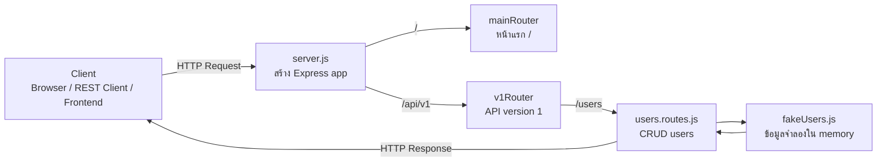
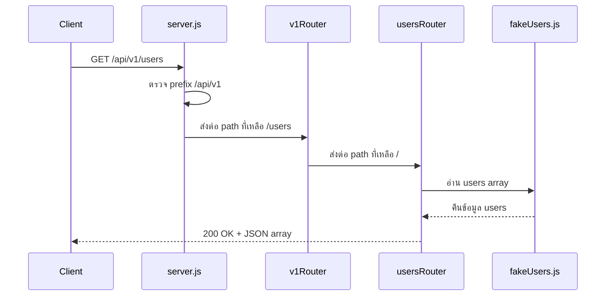
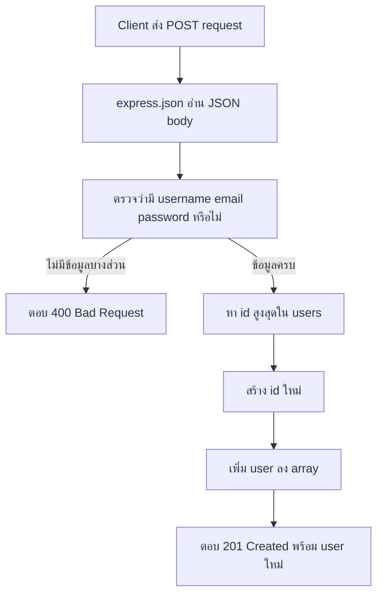
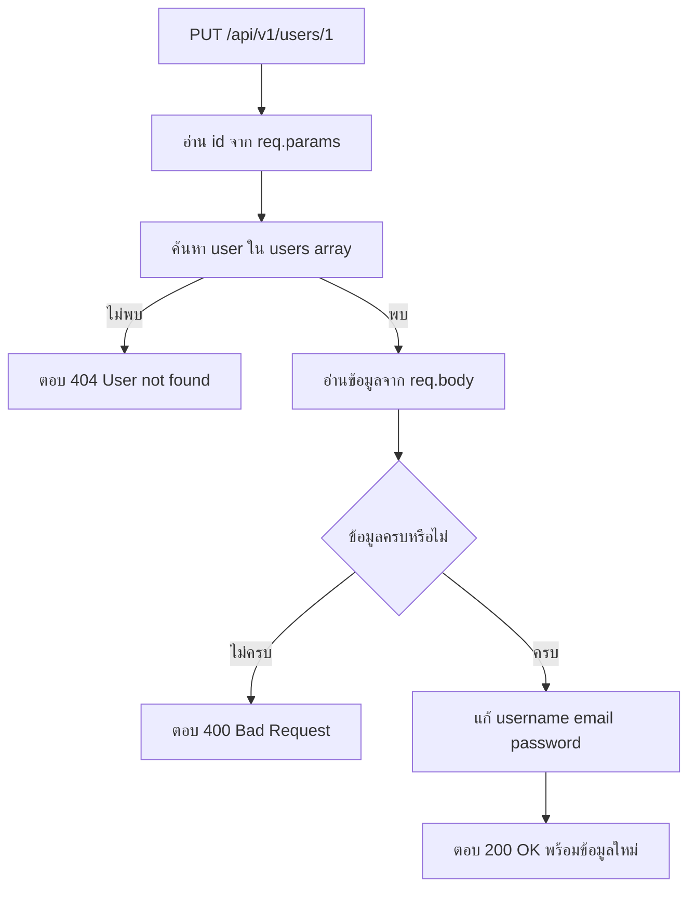
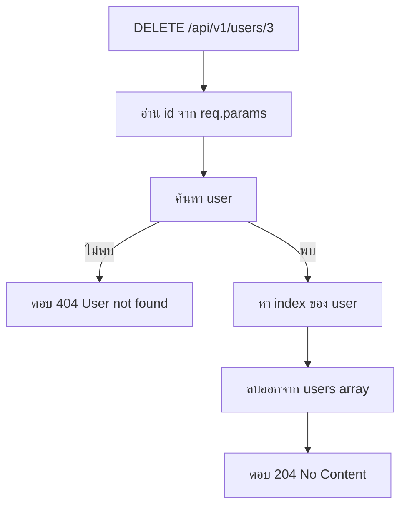
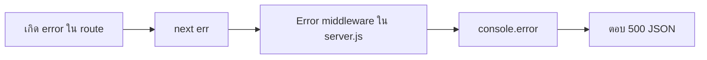

# API Flow Guide

เอกสารนี้อธิบายการทำงานของ API ในโฟลเดอร์ `backend` ตั้งแต่ client ส่ง request เข้ามา จน server ส่ง response กลับไป เหมาะสำหรับคนที่เพิ่งเรียน Express หรือยังสับสนว่าไฟล์แต่ละไฟล์ทำหน้าที่อะไร

---

## 1. ภาพรวมแบบสั้นที่สุด



จำง่าย ๆ:

```text
Client
  |
  v
server.js       จุดรับและกระจาย request
  |
  +-- /              mainRouter       หน้าแรก
  |
  +-- /api/v1        v1Router         กลุ่ม API version 1
                         |
                         +-- /users   usersRouter       CRUD users
```

---

## 2. ไฟล์แต่ละตัวทำหน้าที่อะไร

```text
backend/
├── src/
│   ├── server.js
│   ├── fakeDB/
│   │   └── fakeUsers.js
│   └── routes/
│       ├── index.js
│       └── v1/
│           ├── index.js
│           └── users.routes.js
└── user-api-text.rest
```

### `src/server.js`

เป็นจุดเริ่มต้นของ backend หรือ **entry point**

หน้าที่หลัก:

1. สร้าง Express app
2. เปิดใช้งาน JSON body parser
3. mount router เข้ากับ path หลัก
4. เปิด server ที่ port `3001`
5. จัดการ error ที่ถูกส่งต่อมาด้วย `next(error)`

ส่วนสำคัญ:

```js
app.use(express.json());
app.use("/", mainRouter);
app.use("/api/v1", v1Router);
```

### `src/routes/index.js`

ดูแล route หน้าแรก:

```text
GET /
```

หน้า Matrix ที่เห็นใน browser อยู่ในไฟล์นี้

### `src/routes/v1/index.js`

เป็น router ระดับ version 1 และรวม resource ภายใน v1:

```js
routes.use("/users", usersRouter);
```

ไฟล์นี้ยังไม่ใช่จุดที่ทำ CRUD โดยตรง แต่ทำหน้าที่ส่งต่อไปยัง `users.routes.js`

### `src/routes/v1/users.routes.js`

เป็นไฟล์ที่ตัดสินใจว่าจะทำอะไรกับ users จริง ๆ เช่น อ่าน เพิ่ม แก้ไข และลบ

### `src/fakeDB/fakeUsers.js`

เก็บข้อมูลจำลองใน array แทน database จริง

ข้อควรรู้: เมื่อ restart server ข้อมูลที่เพิ่ม แก้ไข หรือลบจะกลับไปเป็นข้อมูลเริ่มต้น เพราะข้อมูลยังไม่ได้บันทึกลง database ถาวร

---

## 3. วิธีอ่าน URL แบบต่อชิ้นส่วน

เวลามอง route ให้เอา path จากแต่ละชั้นมาต่อกัน:

```text
server.js                    /api/v1
v1/index.js                       /users
users.routes.js                       /
                              ----------------
ผลลัพธ์                       /api/v1/users
```

ตัวอย่าง:

```js
// server.js
app.use("/api/v1", v1Router);

// routes/v1/index.js
routes.use("/users", usersRouter);

// routes/v1/users.routes.js
router.get("/", handler);
```

เมื่อนำมาต่อกันจะได้:

```text
GET /api/v1/users/
```

Express รองรับการเรียกแบบไม่มี slash ท้ายด้วย ดังนั้น URL นี้ก็ใช้ได้:

```text
GET /api/v1/users
```

> อย่าใส่ `/api/v1` ซ้ำใน `users.routes.js` เพราะ `server.js` ใส่ prefix ให้แล้ว

---

## 4. Flow ตอนเรียก `GET /api/v1/users`



โค้ดที่ทำงานจริง:

```js
router.get("/", (req, res) => {
  res.json(users);
});
```

Response ตัวอย่าง:

```json
[
  {
    "id": "1",
    "username": "tonystark",
    "email": "tony.stark@example.com",
    "password": "ironman123"
  }
]
```

---

## 5. Flow ตอนสร้าง user

Request:

```http
POST http://localhost:3001/api/v1/users
Content-Type: application/json
```

```json
{
  "username": "scottlang",
  "email": "scottlang@example.com",
  "password": "antman123"
}
```



สิ่งที่ต้องแยกให้ออก:

- `req.body` คือข้อมูลที่ส่งมาใน JSON body
- `req.params` คือค่าที่อยู่ใน URL เช่น `/:id`
- `res.status(201).json(...)` คือการส่ง status code และ JSON กลับไป

ตัวอย่างโค้ด:

```js
const {username, email, password} = req.body;
```

ถ้าข้อมูลไม่ครบ:

```json
{
  "error": "Missing required fields, Please provide username, email, and password"
}
```

จะได้ status code:

```text
400 Bad Request
```

---

## 6. Flow ตอน Update user

Request:

```http
PUT http://localhost:3001/api/v1/users/1
Content-Type: application/json
```

```json
{
  "username": "tonystark-updated",
  "email": "tony.updated@example.com",
  "password": "newironman123"
}
```



จุดสำคัญของ URL นี้:

```text
/api/v1/users/1
                  ^
                  id อยู่ใน req.params.id
```

โค้ดจะค้นหา user ด้วย:

```js
const user = users.find((u) => u.id === req.params.id);
```

ถ้าพบ จะเปลี่ยนค่าใน object เดิมโดยตรง แล้วตอบกลับด้วย `200 OK`

---

## 7. Flow ตอน Delete user

Request:

```http
DELETE http://localhost:3001/api/v1/users/3
```



`204 No Content` หมายถึงลบสำเร็จ แต่ไม่มี response body ส่งกลับมา

ดังนั้นจึงใช้:

```js
return res.status(204).send();
```

ไม่ควรส่ง JSON ต่อท้าย status `204` เพราะตามมาตรฐาน HTTP response แบบ `204` ต้องไม่มี body

---

## 8. ตารางสรุป Endpoint

| Method | URL | หน้าที่ | สำเร็จเมื่อ | Error ที่สำคัญ |
|---|---|---|---|---|
| `GET` | `/api/v1/users` | อ่าน users ทั้งหมด | `200 OK` | - |
| `POST` | `/api/v1/users` | สร้าง user | `201 Created` | `400` ถ้าข้อมูลไม่ครบ |
| `PUT` | `/api/v1/users/:id` | แก้ไข user | `200 OK` | `400`, `404` |
| `DELETE` | `/api/v1/users/:id` | ลบ user | `204 No Content` | `404` |

ตัวอย่างค่าของ `:id`:

```text
/api/v1/users/1
/api/v1/users/2
/api/v1/users/3
```

---

## 9. Error handling ทำงานอย่างไร

ใน `server.js` มี middleware สำหรับ error:

```js
app.use((err, req, res, next) => {
  console.error(err);

  res.status(500).json({
    error: "Something went wrong on the server",
  });
});
```

Express จะรู้ว่า middleware นี้เป็น error handler เพราะมี parameter ครบ 4 ตัว:

```js
(err, req, res, next)
```

ใน `PUT` และ `DELETE` ถ้าเกิด exception จะส่งต่อมาที่ middleware นี้ด้วย:

```js
catch (err) {
  next(err);
}
```

Flow:



ส่วน `400` และ `404` เป็น error ที่ route รู้จักและจัดการเอง จึงตอบกลับจาก route โดยตรง ไม่ต้องส่งเข้า error middleware

---

## 10. วิธีทดสอบ

ใช้ไฟล์ [user-api-text.rest](user-api-text.rest) กับ REST Client extension ใน VS Code

ลำดับที่แนะนำ:

1. รัน server ด้วย `npm run dev` จากโฟลเดอร์ `backend`
2. ทดสอบ `GET` เพื่อดูข้อมูลเริ่มต้น
3. ทดสอบ `POST` เพื่อเพิ่ม user
4. ทดสอบ `PUT` เพื่อแก้ไข user id ที่มีอยู่
5. ทดสอบ `DELETE` เพื่อลบ user id ที่มีอยู่
6. ทดสอบ `GET` อีกครั้งเพื่อดูผลลัพธ์หลังเปลี่ยนข้อมูล

คำสั่งรัน server:

```bash
cd backend
npm run dev
```

Base URL:

```text
http://localhost:3001
```

ตัวอย่างการยิงด้วย curl:

```bash
curl http://localhost:3001/api/v1/users
```

```bash
curl -X PUT http://localhost:3001/api/v1/users/1 ^
  -H "Content-Type: application/json" ^
  -d "{\"username\":\"newname\",\"email\":\"new@example.com\",\"password\":\"newpassword\"}"
```

```bash
curl -X DELETE http://localhost:3001/api/v1/users/3
```

---

## 11. สิ่งที่ควรระวังในโปรเจกต์ตัวอย่างนี้

### ข้อมูลยังไม่ถาวร

`fakeUsers.js` เป็น array ใน memory ไม่ใช่ database จริง การ restart server จะ reset ข้อมูล

### Password ถูกส่งกลับไปใน response

โปรเจกต์นี้เป็นตัวอย่างเพื่อเรียนรู้ CRUD เท่านั้น ในระบบจริงไม่ควรส่ง password กลับไป และควร hash password ก่อนเก็บ

### `PUT` ต้องส่งข้อมูลครบทุก field

Implementation ปัจจุบันตรวจ `username`, `email` และ `password` ทุกครั้ง ดังนั้นการ update ต้องส่งครบทั้งสามค่า ถ้าต้องการแก้เพียงบาง field ควรออกแบบ `PATCH` เพิ่มภายหลัง

### Route ต้องอยู่ก่อน error middleware

ถ้าวาง error middleware ก่อน routes, request ที่เกิด error อาจไม่ไหลไปยัง handler ที่ต้องการ ดังนั้นลำดับปัจจุบันใน `server.js` ถูกต้อง:

```text
body parser
  -> routes
  -> error handler
```

---

## 12. สรุปจำง่าย

```text
server.js
  = เปิด server และกำหนด prefix

routes/v1/index.js
  = รวม route ของ API v1

routes/v1/users.routes.js
  = ทำงาน CRUD users

fakeDB/fakeUsers.js
  = ข้อมูลจำลอง
```

และ URL นี้:

```text
/api/v1/users/1
```

แปลว่า:

```text
/api       กลุ่ม API
/v1        version 1
/users     resource users
/1         user id 1
```
